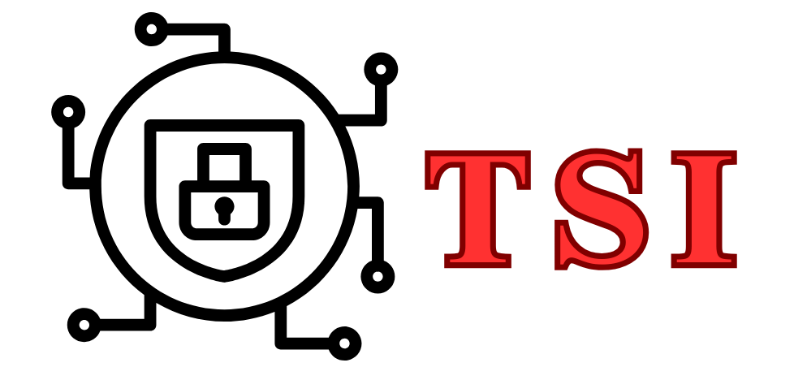

<p align="center">
  
</p>

<p align="center">
  
  
  
  
</p>

# TSI — TLS Server Identifier

**TSI** (**T**LS **S**erver **I**dentifier) is a Java-based framework that can identify the type and version 
of TLS server implementations. For example, it can determine whether a website's server is 
using the OpenSSL-1.1.1x library. Additionally, by integrating publicly available CVE (Common 
Vulnerabilities and Exposures) information, TSI assists pentesters in analyzing the security 
risks of TLS services.

## Prerequisites

- Java 11+
- Maven 3.6+

## Build

```bash
mvn clean package
```

This produces an executable uber-JAR via `maven-shade-plugin`.

## Usage

```bash
java -jar TSI-PB/target/TSI-PB-1.0-SNAPSHOT.jar <TARGET...> [OPTIONS]
```

### Arguments

| Argument | Description |
|----------|-------------|
| `TARGET` | One or more targets in `ip:port` format (e.g., `192.168.0.10:443`) |

### Options

| Option | Description |
|--------|-------------|
| `--config <file>` | Path to a custom configuration file (overrides defaults) |
| `--help` | Show usage information |
| `--version` | Print version |

### Examples

Scan a single server:

```bash
java -jar TSI-PB/target/TSI-PB-1.0-SNAPSHOT.jar 192.168.0.10:443
```

Scan multiple servers (triggers homogeneity analysis):

```bash
java -jar TSI-PB/target/TSI-PB-1.0-SNAPSHOT.jar 10.0.0.1:443 10.0.0.2:443 10.0.0.3:443
```

Use a custom configuration:

```bash
java -jar TSI-PB/target/TSI-PB-1.0-SNAPSHOT.jar --config my-config.properties 10.0.0.1:443
```

## Configuration

Default settings are in `src/main/resources/config.properties`. Key parameters:

| Property | Default | Description |
|----------|---------|-------------|
| `network.socket.timeout` | 1000 | Socket timeout in milliseconds |
| `network.socket.interval` | 2000 | Delay between probes in milliseconds |
| `fingerprint.similarity.threshold` | 0.9 | Minimum similarity score for version matching (0.0–1.0) |

## Output

Results are written to the `output/` directory (configurable):

- **`<scanId>_fingerprint_<ip>_<port>.json`** — Per-target scan report containing the extracted fingerprint, matched versions with similarity scores, and associated CVEs.
- **`<scanId>_homogeneity.json`** — Homogeneity report with pairwise similarity scores and overall homogeneity value (generated when multiple targets are scanned).

## Datasets

| Dataset | Description                                                                                 | Location |
|---------|---------------------------------------------------------------------------------------------|----------|
| TLS CVE Dataset | SQLite database mapping TLS library versions to known CVEs                                  | [`src/main/resources/cves.sqlite`](TSI-PB/src/main/resources/cves.sqlite) |
| TLS Server Dataset | Docker images of TLS servers across multiple library versions, used to learn Mealy machines | [Docker Hub: identifytls/tls_docker_images](https://hub.docker.com/r/identifytls/tls_docker_images) |

## Project Structure

```
TSI-PB/
├── src/main/java/org/example/tlsscanner/
│   ├── App.java                          # CLI entry point (picocli)
│   ├── api/                              # Scanner abstractions
│   │   ├── GenericScanner.java           # Base scanner with target iteration
│   │   ├── ExternalScanner.java          # Base for external-tool-based scanners
│   │   ├── FingerprintComparator.java    # Similarity comparison interface
│   │   └── datastructures/
│   │       └── Fingerprint.java          # Generic fingerprint container
│   ├── tsi/                              # TSI implementation
│   │   ├── TSIScanner.java               # Core scanning logic
│   │   ├── analyzer/
│   │   │   ├── TSIFingerprintComparator.java  # Set-intersection similarity
│   │   │   ├── VersionIdentifier.java         # Fingerprint-to-version matching
│   │   │   ├── VulnerabilityIdentifier.java   # CVE lookup via SQLite
│   │   │   └── HomogeneityCalculator.java     # Pairwise homogeneity scoring
│   │   ├── datastructures/               # TSI-specific data types
│   │   └── network/                      # TLS connection and symbolization
│   ├── config/
│   │   └── ConfigurationManager.java     # Configuration loading
│   └── common/                           # Shared utilities
└── src/main/resources/
    ├── config.properties                 # Default configuration
    ├── probes.txt                        # Probe sequence definitions
    ├── fingerprints/                     # Reference fingerprint database (JSON)
    ├── messages/                         # TLS-Attacker XML message templates
    └── cves.sqlite                       # CVE database
```

## Dependencies

- [TLS-Attacker](https://github.com/tls-attacker/TLS-Attacker) — TLS protocol message construction and transport
- [picocli](https://picocli.info/) — Command-line argument parsing
- [Jackson](https://github.com/FasterXML/jackson) — JSON serialization
- [SQLite JDBC](https://github.com/xerial/sqlite-jdbc) — CVE database access

## License

See [LICENSE](LICENSE) for details.
